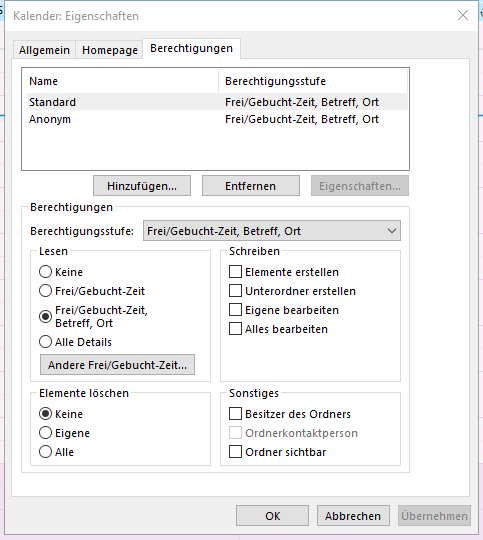

# Outlook

## Berechtigungen einrichten
Damit andere deinen Outlook Kalender einsehen können und dabei auch sehen können, was bei dir wo gebucht ist:
* Wechsle in Outlook auf die Kalender Ansicht
* Wähle das Register "Start"
* Klicke auf das Symbol "Kalenderberechtigungen". Das Symbol befindet sich ziemlich weit rechts in der Symbolleiste
* Ändere die Berechtigungen in in der Optionsgruppe "Lesen" für "Standard" und "Anonym" auf "Frei/Gebucht-Zeit, Betreff, Ort wie unten im Bild abgebildet.

